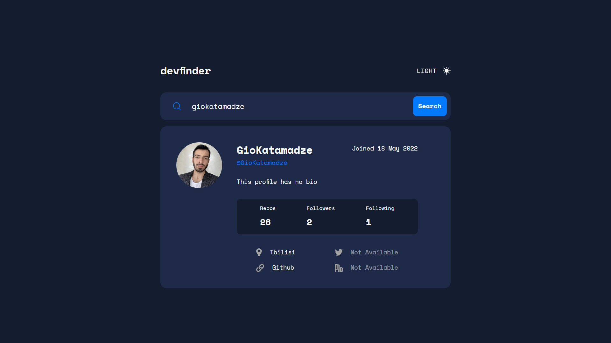
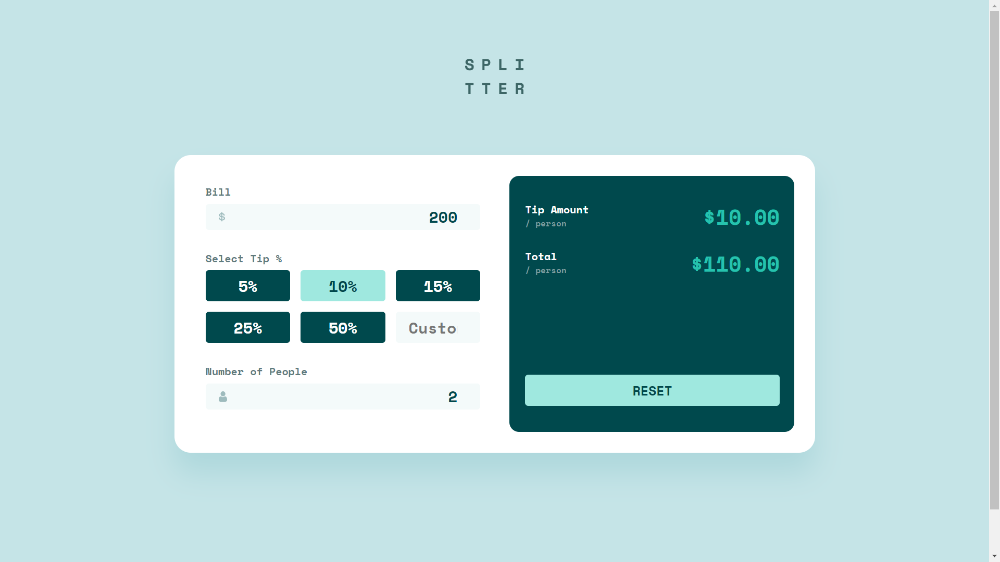
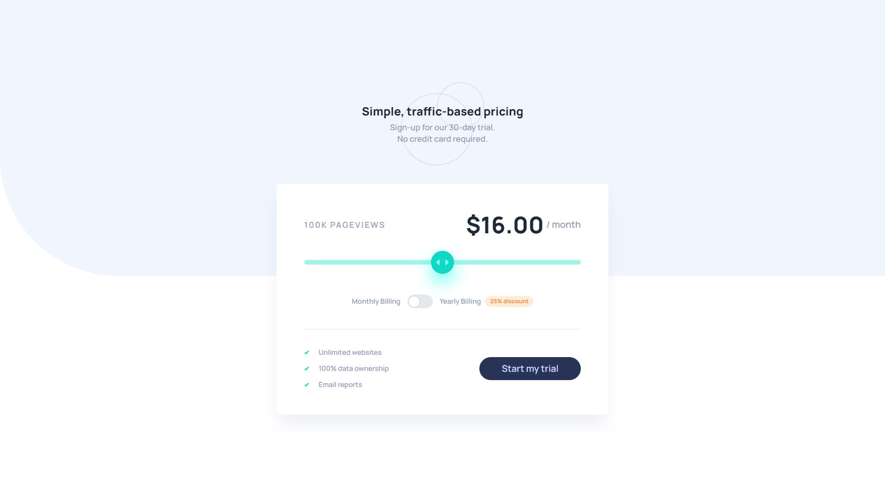
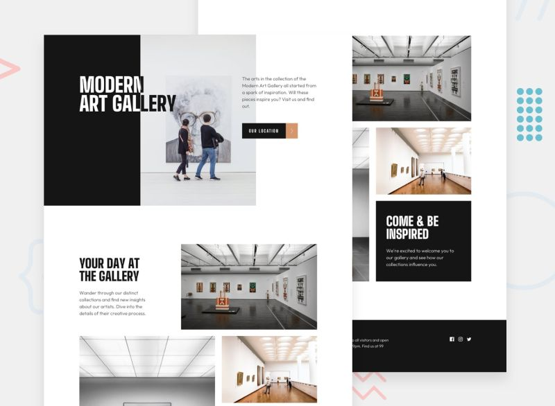
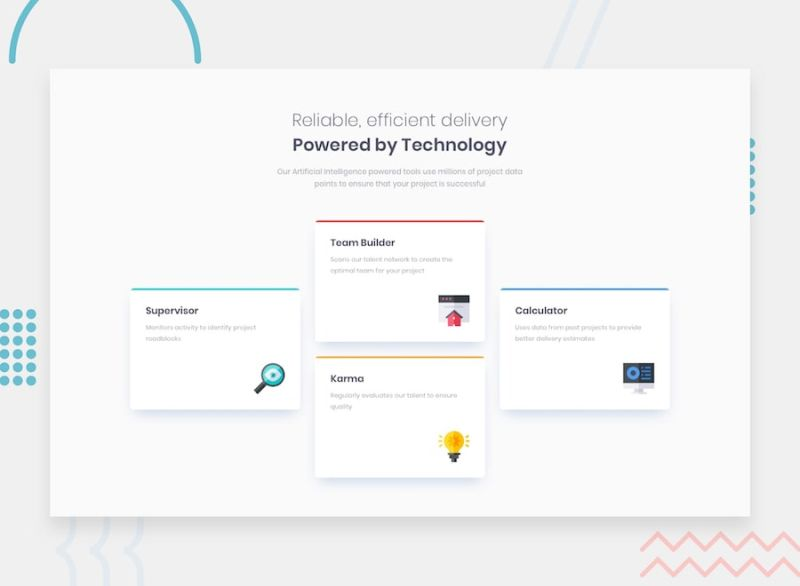
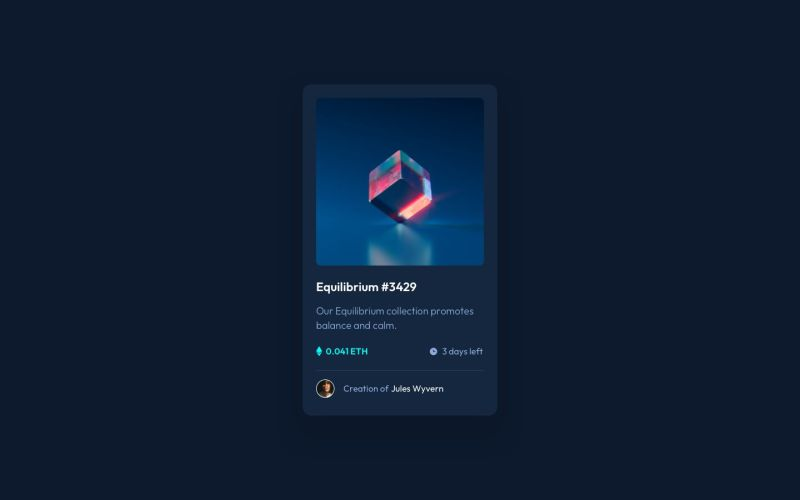

## Hi there 👋

I am Gio, Full Stack Developer. You can contact me via:
- Linkedin - [Gio Katamadze](https://www.linkedin.com/in/gio-katamadze-a409931a7)
- Gmail - giokat.inbox@gmail.com

## Projects

Product Feedback App

 
  

### Links
- Live Site URL: [Live](https://vocal-paprenjak-6f9f8e.netlify.app/)
- Frontend URL: [GitHub Code](https://github.com/GioKatamadze/Product-feedback-app-front)
- Backend URL: [GitHub Code](https://github.com/GioKatamadze/Product-feedback-app-API)

### Built with
- React JS
- Node JS
- Express/Rest API
- js/jsx/yaml
- Tailwind
- Redux
- Swagger
- MongoDB
- Mongoose
- Joi validation
  

Picnic

 
  

### Links
- Frontend Solution URL: [GitHub Code](https://github.com/GioKatamadze/picnic-front)
- Backend Solution URL: [GitHub Code](https://github.com/GioKatamadze/picnic-api)
- Live Site URL: [GitHub LIve](https://hilarious-meringue-941730.netlify.app/)

### Built with
- React JS
- Node JS
- Express js
- AG Grid

Github User Search APP

 
  

### Links
- Solution URL: [GitHub Code](https://github.com/GioKatamadze/Github_User-Search_APP)
- Live Site URL: [Demo LIve](https://dashing-mandazi-c74cb8.netlify.app/)

### Built with
- React JS
- Node JS
- Github API
- Mobile first approach
- GitFlow workflow
- React styled components

IP Address Tracker

 
  

### Links
- Solution URL: [GitHub Code](https://github.com/GioKatamadze/ip-address-tracker)
- Live Site URL: [Netlify Live](https://gleaming-entremet-84bd7a.netlify.app/)

### Built with
- React JS
- Node JS
- Leaflet JS
- IPify
- CSS custom properties
- Mobile first approach
- Flexbox
- Media Queries
- GitFlow workflow

Tic Tac Toe

 
  

### Links
- Solution URL: [GitHub Code](https://github.com/GioKatamadze/Tic-Tac-Toe)
- Live Site URL: [GitHub LIve](https://giokatamadze.github.io/Tic-Tac-Toe//)

### Built with
- HTML5 
- CSS
- Mobile first approach
- Vanilla Javascript

Launch countdown timer

 
  

### Links
- Solution URL: [GitHub Code](https://github.com/GioKatamadze/Launch-Countdown-Timer)
- Live Site URL: [GitHub LIve](https://giokatamadze.github.io/Launch-Countdown-Timer/)

### Built with
- HTML5 
- CSS
- Mobile first approach
- Vanilla Javascript

Tip Calculator App

 
  

### Links
- Solution URL: [GitHub Code](https://github.com/GioKatamadze/Tip-Calculator-App)
- Live Site URL: [GitHub LIve](https://giokatamadze.github.io/Tip-Calculator-App//)

### Built with
- HTML5 
- CSS
- Mobile first approach
- Vanilla Javascript

Interactive pricing component

 
  

### Links
- Solution URL: [GitHub Code](https://github.com/GioKatamadze/Interactive-Pricing-Component)
- Live Site URL: [GitHub LIve](https://giokatamadze.github.io/Interactive-Pricing-Component/src/index.html)

### Built with
- HTML5
- Tailwind CSS
- Vanilla Javascript

Single-Page Design Portfolio

 
  

### Links
- Solution URL: [GitHub Code](https://github.com/GioKatamadze/Single-Page-Design)
- Live Site URL: [GitHub LIve](https://giokatamadze.github.io/Single-Page-Design/)

### Built with
- Semantic HTML5 markup
- CSS custom properties
- Mobile first approach
- Vanilla Javascript

FAQ Accordion Card

 
  

### Links
- Solution URL: [GitHub Code](https://github.com/GioKatamadze/FAQ-Accordion-Card)
- Live Site URL: [GitHub LIve](https://giokatamadze.github.io/FAQ-Accordion-Card//)

### Built with
- Semantic HTML5 markup
- CSS custom properties
- Mobile first approach
- Vanilla Javascript

Type Master Pre-Launch Landing Page

 
  

### Links
- Solution URL: [GitHub Code](https://github.com/GioKatamadze/Typemaster-Pre-Launch-Landing-Page)
- Live Site URL: [GitHub LIve](https://giokatamadze.github.io/Typemaster-Pre-Launch-Landing-Page//)

### Built with
- Semantic HTML5 markup
- CSS custom properties
- Mobile first approach

Equalizer Landing Page

 
  

### Links
- Solution URL: [GitHub Code](https://github.com/GioKatamadze/Equalizer-Landing-Page)
- Live Site URL: [GitHub LIve](https://giokatamadze.github.io/Equalizer-Landing-Page//)

### Built with
- Semantic HTML5 markup
- CSS custom properties
- Mobile first approach

Art Gallery Website

 
  

### Links
- Solution URL: [GitHub Code](https://github.com/GioKatamadze/Art-Gallery-Website)
- Live Site URL: [GitHub LIve](https://giokatamadze.github.io/Art-Gallery-Website/index.html)

### Built with
- Semantic HTML5 markup
- CSS custom properties
- Mobile first approach

Skilled Elearning Landing Page

 
  

### Links
- Solution URL: [GitHub Code](https://github.com/GioKatamadze/Skilled-Elearning-Landing-Page)
- Live Site URL: [GitHub LIve](https://giokatamadze.github.io/Skilled-Elearning-Landing-Page//)

### Built with
- Semantic HTML5 markup
- CSS custom properties
- Mobile first approach

Four Card Feature Section

 
  

### Links
- Solution URL: [GitHub Code](https://github.com/GioKatamadze/Four-Card-Feature-Section)
- Live Site URL: [GitHub LIve](https://giokatamadze.github.io/Four-Card-Feature-Section/)

### Built with
- Semantic HTML5 markup
- CSS custom properties
- Mobile first approach

Fylo Landing Page With Two Column Layout

 
  

### Links
- Solution URL: [GitHub Code](https://github.com/GioKatamadze/Fylo-Landing-Page-With-Two-Column-Layout)
- Live Site URL: [GitHub LIve](https://giokatamadze.github.io/Fylo-Landing-Page-With-Two-Column-Layout//)

### Built with
- Semantic HTML5 markup
- CSS custom properties
- Mobile first approach

Profile Card Component

 
  

### Links
- Solution URL: [GitHub Code](https://github.com/GioKatamadze/Profile-Card-Component)
- Live Site URL: [GitHub LIve](https://giokatamadze.github.io/Profile-Card-Component/)

### Built with
- Semantic HTML5 markup
- CSS custom properties
- Mobile first approach

NFT preview card component

 
  

### Links
- Solution URL: [GitHub Code](https://github.com/GioKatamadze/NFT-Preview-Card-Component)
- Live Site URL: [GitHub LIve](https://giokatamadze.github.io/NFT-Preview-Card-Component/)

### Built with
- Semantic HTML5 markup
- CSS custom properties

Order Summary Component

 
  

### Links
- Solution URL: [GitHub Code](https://github.com/GioKatamadze/Order-Summary-Component)
- Live Site URL: [GitHub LIve](https://giokatamadze.github.io/Order-Summary-Component//)

### Built with
- Semantic HTML5 markup
- CSS custom properties

