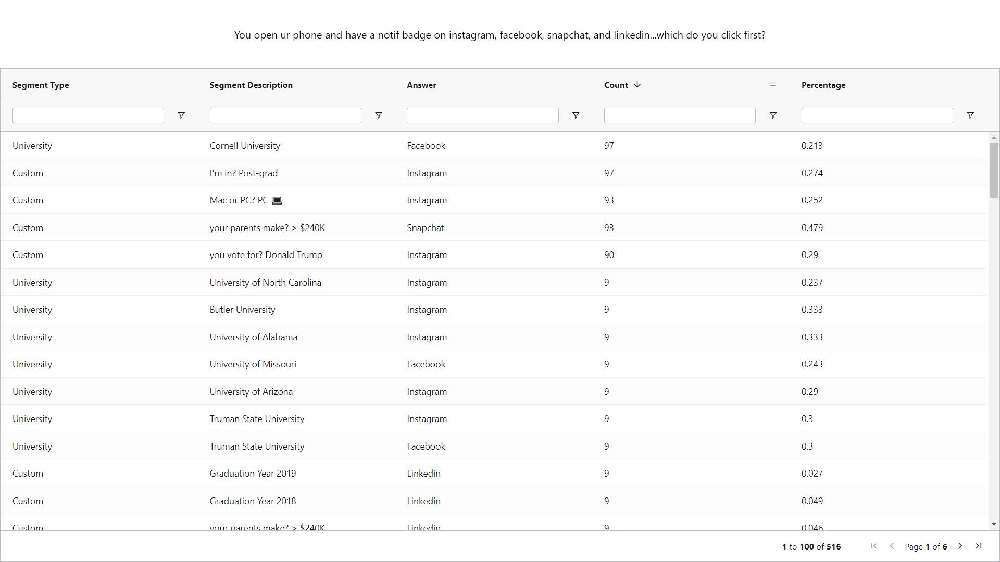

## Hi there 👋

I am Gio, Full Stack Developer. You can contact me via:
- Linkedin - [Gio Katamadze](https://www.linkedin.com/in/gio-katamadze-a409931a7)
- Gmail - giokat.inbox@gmail.com

## Projects

Product Feedback App

 
  

### Links
- Live Site URL: [Live](https://vocal-paprenjak-6f9f8e.netlify.app/)
- Frontend URL: [GitHub Code](https://github.com/GioKatamadze/Product-feedback-app-front)
- Backend URL: [GitHub Code](https://github.com/GioKatamadze/Product-feedback-app-API)

### Built with
- React JS
- Node JS
- Express/Rest API
- js/jsx/yaml
- Tailwind
- Redux
- Swagger
- MongoDB
- Mongoose
- Joi validation

Picnic

 
  

### Links
- Frontend Solution URL: [GitHub Code](https://github.com/GioKatamadze/picnic-front)
- Backend Solution URL: [GitHub Code](https://github.com/GioKatamadze/picnic-api)
- Live Site URL: [GitHub LIve](https://hilarious-meringue-941730.netlify.app/)

### Built with
- React JS
- Node JS
- Express js
- AG Grid

Github User Search APP

 
  

### Links
- Solution URL: [GitHub Code](https://github.com/GioKatamadze/Github_User-Search_APP)
- Live Site URL: [Demo LIve](https://dashing-mandazi-c74cb8.netlify.app/)

### Built with
- React JS
- Node JS
- Github API
- Mobile first approach
- GitFlow workflow
- React styled components

